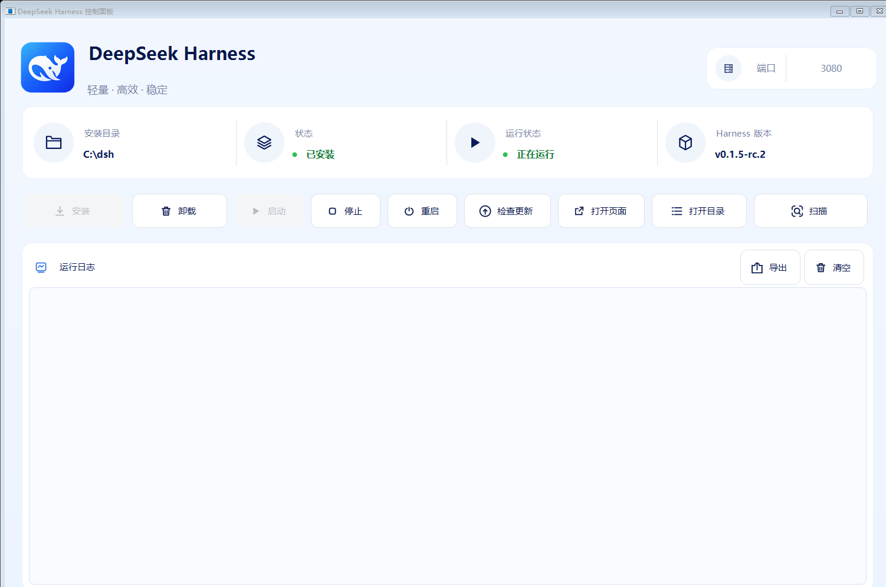

# DeepSeek Harness 控制面板

用于 Windows 10/11 x64 的 DeepSeek Harness 管理工具。它可检测本机安装、安装官方 Harness、启动、重启、停止，以及检查 Harness 更新。



## 包含内容

- `src/DeepSeekHarnessControlPanel.cs`：Windows Forms 源码
- `assets/DeepSeekHarness.ico`：蓝鲸程序图标
- `scripts/build.ps1`：本地构建脚本
- `scripts/test.ps1`：策略层测试脚本
- `scripts/build-installer.ps1`：生成 per-user 安装包
- `scripts/verify-installer.ps1`：校验安装脚本（不需要 Inno Setup）
- `installer/DeepSeekHarnessControlPanel.iss`：Inno Setup 安装脚本
- `tests/`：策略类测试（纯逻辑，不依赖网络与 Harness 安装）
- `LICENSE`：MIT 许可证
- `docs/images/panel.png`：上面的界面截图，由测试渲染生成

本仓库不包含 API Key、用户配置、Harness 安装目录、依赖缓存或测试日志。

## 构建

在 Windows PowerShell 中运行：

```powershell
powershell -ExecutionPolicy Bypass -File .\scripts\build.ps1
```

生成的程序位于 `bin\DeepSeekHarnessControlPanel.exe`。

面板正在运行时 `bin\DeepSeekHarnessControlPanel.exe` 会被占用，此时重建会以 `CS1567` 失败。用 `-OutputDirectory` 把产物输出到别处即可在不关闭面板的情况下编译：

```powershell
powershell -ExecutionPolicy Bypass -File .\scripts\build.ps1 -OutputDirectory .\bin-staging
```

`scripts\test.ps1` 接受同样的参数：

```powershell
powershell -ExecutionPolicy Bypass -File .\scripts\test.ps1 -OutputDirectory .\bin-staging
```

### 界面截图

README 顶部的 `docs/images/panel.png` 是渲染出来的，不是手工截屏。测试里的 `LogViewRenderingTests` 会构造真实的窗口，用 `DrawToBitmap` 画出客户区并存成 `log-preview.png`，所以界面改动后重新生成一次，截图就不会停留在旧版本：

```powershell
powershell -ExecutionPolicy Bypass -File .\scripts\test.ps1 -OutputDirectory .\bin-staging
Copy-Item .\bin-staging\log-preview.png .\docs\images\panel.png -Force
```

截图是代码画出来的，因此它同时也是一道检查：布局被改坏时，先看这张图比对着代码猜要快。

## 使用

运行生成的控制面板后：

1. 在未安装 Harness 的电脑上点击“安装”并选择空目录。
2. 安装完成后使用“启动”“重启”“停止”控制服务。
3. “检查 Harness 更新”仅检查官方 `deepseek-ai/deepseek-harness` 仓库的更新，不更新此控制面板。
4. 关闭窗口即退出控制面板。Harness 是独立进程，**服务不受影响**，需要时再从面板启动或停止它。
5. “卸载”会列出每个删除目标及大小，其中**用户数据默认不勾选**。

## 安装包

需要先安装 [Inno Setup 6](https://jrsoftware.org/isdl.php)（免费），然后运行：

```powershell
powershell -ExecutionPolicy Bypass -File .\scripts\build-installer.ps1
```

版本号从源码里的 `PanelVersionPolicy.Version` 读取，因此可执行文件的版本资源和安装包不会不一致。产物位于 `bin\installer\`。

没有安装 Inno Setup 时，脚本会说明缺少什么并以退出码 2 结束，而不会抛出堆栈。

### 安装包的行为

- **免 UAC**：安装到 `%LOCALAPPDATA%\Programs\DeepSeekHarnessControlPanel`，全程不需要管理员权限。
- **升级**：使用固定 `AppId`，新版本替换旧版本而不是并排安装。
- **开机自启**：默认不勾选；勾选后写入 `HKCU` 的 `Run` 项，与面板内的同名开关是同一处。
- 安装包只包含控制面板本身，Harness 仍由面板自行安装。

### 卸载边界（重要）

安装包的卸载器**只删除控制面板自己**，不会碰以下任何内容：

- Harness 安装目录（例如 `C:\dsh`）及其 `.dsh-runtime`、`logs`
- `%USERPROFILE%\.dsh` —— 其中的 API Key、会话记录和附件删掉无法恢复
- Harness 安装目录内的 `.dsh-manager-state.json`

删除 Harness 请使用面板内的“卸载”。两者必须严格分开：卸载一个几百 KB 的面板不应该连带丢掉无法恢复的凭据和会话。

这条边界不只写在注释里，`scripts\verify-installer.ps1` 会实际检查它——任何指向上述路径的指令、或 `[UninstallDelete]` 里的递归删除，都会让校验失败：

```powershell
powershell -ExecutionPolicy Bypass -File .\scripts\verify-installer.ps1
```

## 说明

此工具通过官方 GitHub 仓库下载 DeepSeek Harness，并使用本机的 Node.js/pnpm；缺失时会在 Harness 安装目录准备私有运行环境。它不是 DeepSeek 官方发布的桌面客户端。

### 网络传输

面板默认使用 .NET Framework 的 `HttpClient`。在某些代理配置下（例如 TUN + fake-IP 把所有域名解析到 `198.18.0.0/15`），.NET 的 SCHANNEL 无法完成 TLS 握手，报“未能创建 SSL/TLS 安全通道”，而 Node 的 OpenSSL 栈可以正常连接。此时面板会自动改用内置的 Node 取回脚本继续请求，并在日志中说明切换原因。该回退是被动的：.NET 正常工作时不会启用，也不会在 `%TEMP%` 留下任何文件。

本地 Harness 页面（`127.0.0.1:3080`）的探测始终走 .NET，不受影响。

## 许可证

[MIT](LICENSE)。可以自由使用、修改和再分发，只需保留版权声明与许可证原文。
